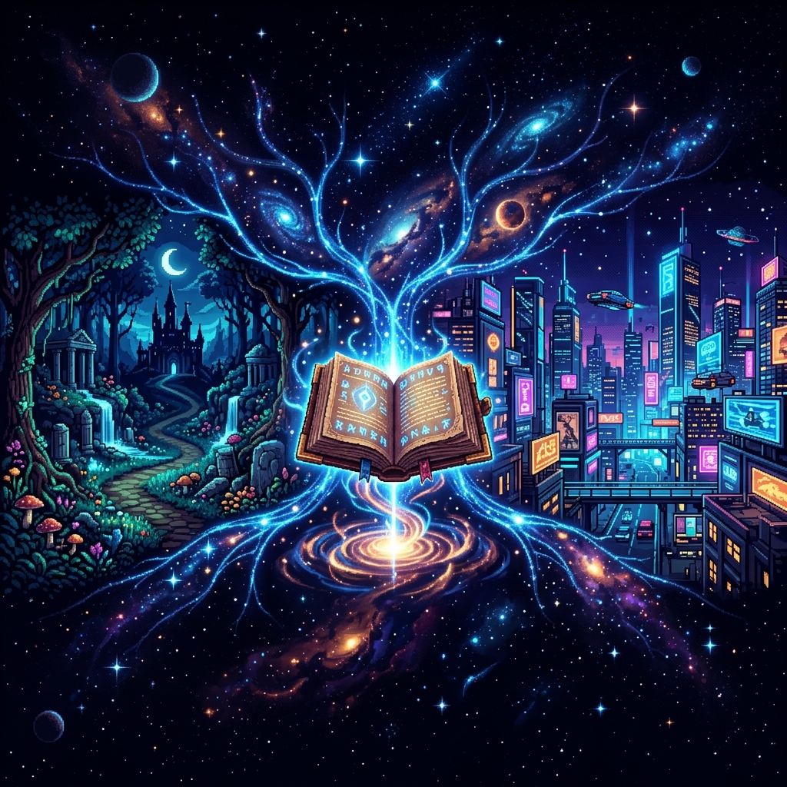
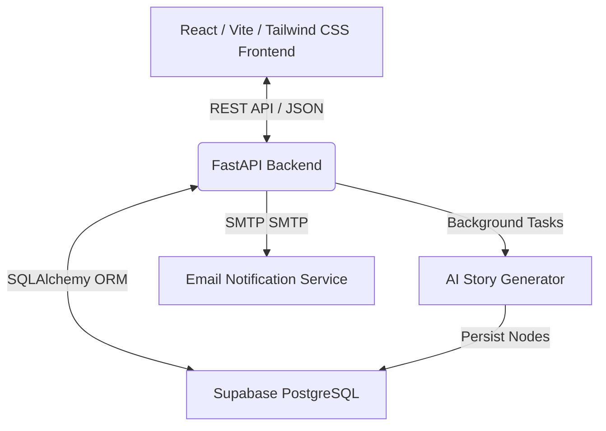

# <p align="center"></p>

<p align="center">
  
  
  
  
  
</p>

---

## 🔮 What is ForkTales?

**ForkTales** is an AI-powered, interactive fiction platform where players and creators forge unique, branching choose-your-own-adventure narratives. Powered by an advanced AI storyteller, every choice you make weaves a custom tale, accompanied by striking retro pixel-art illustrations, rich character traits, and immersive soundscapes.

Whether you want to explore a dark mystical forest, navigate the neon-lit alleyways of a cyberpunk metropolis, or embark on a classic high-fantasy quest, ForkTales generates entire branching story paths dynamically in the background, making every run truly unique.

---

## ✨ Features

- 🪄 **AI-Powered Branching Narratives**: Generate deep, multi-path storylines dynamically with custom themes, adjustable difficulties (Easy/Hard), and multiple language supports.
- ⚡ **Daily Mana System**: A gamified credit system refilling 5 Mana Points daily for creators to forge new realms without overwhelming the realm's resources.
- 🎨 **Visual & Auditory Immersion**: Immersive pixel-art backgrounds for story nodes, paired with custom sprite animations (`AnimatedSprite`) and a clean, responsive layout.
- 📚 **Arcade Library & Community Hub**: Publish your completed adventures to the public gallery, browse other players' tales, or delete your older archives.
- ⚡ **Asynchronous Background Jobs**: Story generation happens fully in the background. Close the tab or explore other areas while the AI weaves your tale.
- 📧 **Magical Email Notifications**: Enter your email to receive a magical summon (notification link) as soon as your newly forged adventure is ready to be played.
- 📱 **Progressive Web App (PWA)**: Completely optimized for mobile and desktop screens with custom PWA capabilities for full-screen retro arcade vibes.

---

## 🛠️ The Tech Stack

ForkTales uses a modern, high-performance architecture built for speed and seamless interactivity.



### Frontend (`/frontend`)
- **Framework**: [React](https://react.dev/) + [Vite](https://vite.dev/) (lightning-fast dev server and optimized builds)
- **Styling**: [Tailwind CSS](https://tailwindcss.com/) (modern responsive designs, custom neon palettes, glassmorphic UI)
- **State & Router**: Modern React Hooks and custom Context Providers for global state.
- **Visual Effects**: Custom keyframe animations, audio feedback triggers, and interactive branching node maps.

### Backend (`/backend`)
- **Core Framework**: [FastAPI](https://fastapi.tiangolo.com/) (Python 3.10, asynchronous routing, native Swagger docs)
- **Database**: PostgreSQL hosted on [Supabase](https://supabase.com/) for high-speed cloud database operations.
- **ORM & Migrations**: SQLAlchemy for database schemas and model representations.
- **Background Workers**: Native FastAPI `BackgroundTasks` executing heavy AI generation and email dispatches out-of-band.

---

## 🚀 Setting Up the Realm (Installation)

### Prerequisites
Make sure you have **Node.js** (v18+) and **Python** (3.10+) installed.

---

### 📡 1. Starting the Backend Service

Navigate to the `backend` folder and follow these steps:

1. **Create and Activate a Virtual Environment**:
   ```bash
   cd backend
   python -m venv .venv
   
   # Windows (PowerShell)
   .\.venv\Scripts\Activate.ps1
   
   # macOS/Linux
   source .venv/bin/activate
   ```

2. **Install Dependencies**:
   ```bash
   pip install -r requirements.txt
   ```

3. **Configure Environment Variables**:
   Create a `.env` file inside the `backend` folder with your credentials:
   ```env
   DATABASE_URL=your_supabase_postgresql_url
   OPENAI_API_KEY=your_openai_or_story_generator_key
   ALLOWED_ORIGINS=["http://localhost:5173", "http://127.0.0.1:5173"]
   # Add your SMTP configuration if you want email alerts to work
   ```

4. **Launch the FastAPI Server**:
   ```bash
   uvicorn main:app --reload
   ```
   The backend API will run at `http://localhost:8000`. You can inspect the fully interactive Swagger docs at `http://localhost:8000/docs`.

---

### 💻 2. Starting the Frontend UI

Navigate to the `frontend` folder and follow these steps:

1. **Install Frontend Dependencies**:
   ```bash
   cd frontend
   npm install
   ```

2. **Configure Frontend Environment**:
   Create a `.env` file inside the `frontend` folder:
   ```env
   VITE_API_URL=http://localhost:8000/api/v1
   ```

3. **Launch the Vite Development Server**:
   ```bash
   npm run dev
   ```
   Open `http://localhost:5173` in your browser to begin your first choose-your-own-adventure!

---

## 📖 Playing & Creating Stories

1. **Login or Create an Account**: Set up a profile to manage your adventure library.
2. **Refill your Mana**: Begin each day with `5 Mana Points` ⚡.
3. **Forge a Story**: Enter a theme (e.g., *"A forgotten castle guarded by a clockwork dragon"*), select your language, choose your difficulty, and click **Forge Adventure**.
4. **Choose Your Path**: Once generated, dive in! Read each story node, look at the visual illustration, and select one of the available choices to steer the story.
5. **Share with the World**: Finish a story and toggle the **Publish** switch in your dashboard to let anyone in the community play your creation!

---

## 🎨 Aesthetic Design Principles

ForkTales was meticulously designed to deliver an aesthetic retro-modern gamer feel:
- **Mystical Palettes**: Deep void-blacks (`#05020a`), royal dark purples, and high-contrast glowing cyans/emeralds.
- **Glassmorphism**: Elegant translucent cards reflecting starry, glowing, and shifting gradient backdrops.
- **Responsive Navigation**: Adapts perfectly across dynamic screen ratios from small mobile devices up to 4K monitors.
- **Micro-Animations**: Shivering sprites, button glows, fluid transitions, and glowing path lines.

---

## 📜 License

This project is licensed under the [MIT License](LICENSE).

---

<p align="center">Made with 💜 by Kanishka. Forge your destiny, choice by choice.</p>
